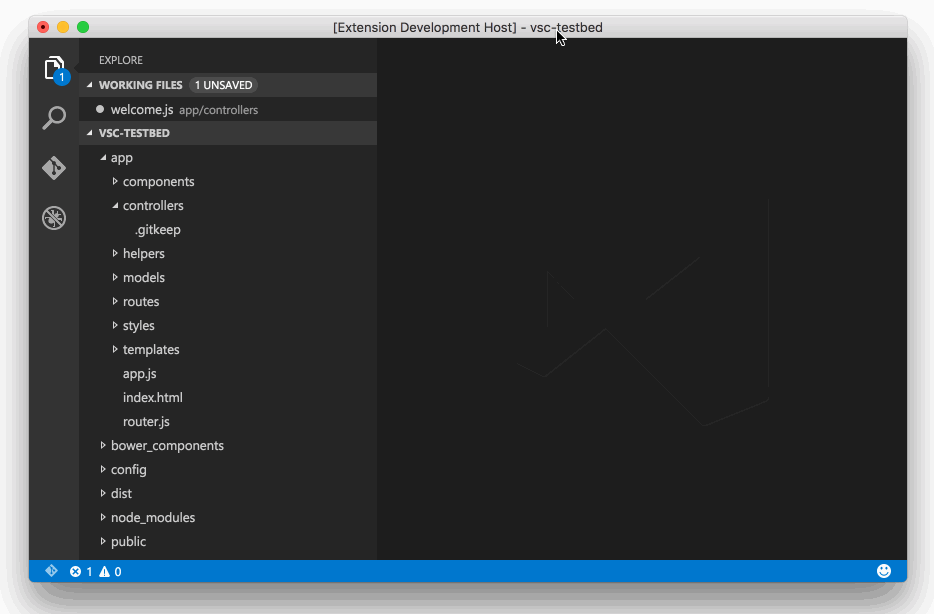

## Ember Cli Extension for Visual Studio Code
[](https://travis-ci.org/felixrieseberg/vsc-ember-cli)

Use Ember and Ember Cli directly from Visual Studio Code. After installation, all `ember cli` commands are available through Code's own command list, enabling you for example to generate blueprints, run tests, or build your app without leaving your editor. Also, IntelliSense for Ember!



#### Features
 * Visual Studio Code is automatically configured to play well with Ember Cli projects - as soon as a `.ember-cli` file is detected in the workspace, we'll create a fitting `jsconfig.json` to ensure that Visual Studio Code enables ES6 and Modules support. 
 * Typings to enable IntelliSense Support for Ember!
 * All Ember Commands are available through Visual Studio Code's Command Palette.
 * Snippets make day-to-day tasks a lot easier

#### Commands Implemented
 * Create addon folder structure (also known as `ember addon`)
 * Build app (also known as `ember build`)
 * Build, watch, and live-reload app (also known as `ember serve`)
 * Generate blueprint(also known as `ember generate`)
 * Destroy blueprint (also known as `ember destroy`)
 * Create new app in the current workspace (also known as `ember init`)
 * Create new app in a sub-folder in the current workspace (also known as `ember new`)
 * Install ember addon (also known as `ember install`)
 * Display the Ember Cli version (also known as `ember version`)
 * Run tests (also known as `ember test`)
 * Run tests in server mode (also known as `ember test --server`)
 * Setup project for development in Visual Studio Code
 
## Install
In Visual Studio Code, run `ext install vsc-ember-cli` - or, simply hit `CMD/CTRL + Shift + P`, search for "Install Extension", and then search for "ember cli".

### Usage in subfolder
If your Ember app is within a subfolder of your workspace, you have to create an `ember.json` file in the `.vscode` folder of your workspace.
If the `.vscode` folder doesn't exist yet, you also have to create it.
After that you have to add a config that specifies the folder in which the Ember app resides.

Example:

```json
{
  "appPath": "./ember-app"
}
```

The addon will do the regular setup (like creating a `jsconfig.json`) as soon as the first command is executed.  
Tip: There is a command to setup the project for Visual Studio Code.

## IntelliSense Support
Support is experimental - IntelliSense is enabled with typings, which are automatically installed in a `typings` folder inside your project. The typings file should be automatically detected, but if not, you can either add it to your project's [`jsconfig.json`](https://code.visualstudio.com/Docs/languages/javascript#_javascript-projects-jsconfigjson), or add a `/// reference` to the typings in individual files.

To disable the automatic installation, create a `ember.json` file inside your project's `.vscode` folder and set the `installTypings` property to false:

```
{
    "installTypings": false
}
```

## Bugs and Issues
Under the covers, this addon is merely executing Ember commands for you. In practice, this sometimes leads to issues, since the addon does not come with Ember Cli and is absolutely reliant on your system being setup properly. To debug issues, set an environment variable named `VSC_EMBER_CLI_DEBUG` - Visual Studio Code will then always display the output window for all operations, allowing you to see what's happening in the terminal.

## Contributions
There's a few things that could improve the extension - snippets and IntelliSense support is probably at the very top of everyone's wish list. Contributions are extremely welcome!

## Credits & License
IntelliSense for Ember was made possible in parts by Tilde's [Peter Wagenet](https://github.com/wagenet) and Ciena's [Steven Glanzer](https://github.com/sglanzer), [Eric White](https://github.com/ewhite613), and [Justin Lafleur](https://github.com/laflower). 

MIT, please see LICENSE for details. Copyright (c) 2015 Felix Rieseberg and Microsoft Corporation.
